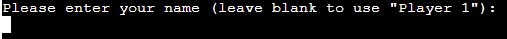
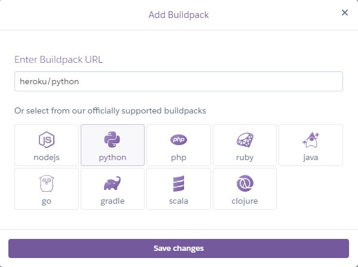

# Battleships

This application is a text based version of the classic game Battleships where the aim of the game is to destroy the opponent's ships before they destroy yours.

The game is played fully within a mock 'console' that was created by The Code Institute. The goals of the application are:

**Site Owner**

- To provide an interactive text-based version of battleships that can be played online for entertainment.
- To replicate the classic elements of the game including different ship sizes and the ability to chose where they are placed

**Site Users**

- To play an online version of battleships
- To be able to easily understand how to play the game
- To be able to play the game without needing to read lots of text

## Live Site

The live site can be found [here](https://dashboard.heroku.com/apps/battleships-by-adh).

## Table of Contents
- [Features](<#features>)
	- [Existing Features](<#existing-features>)
		- [Landing Screen](<#landing-screen>)
		- [Enter Name](<#enter-name>)
		- [Welcome Screen](<#welcome-screen>)
		- [Rules Screen](<#rules-screen>)
		- [Game Start](<#game-start>)
		- [Placing Ships](<#placing-ships>)
		- [Commence Attack](<#commence-attack>)
		- [Fire Screen](<#fire-screen>)
		- [Win Screen](<#win-screen>)
		- [Rematch Screen](<#rematch-screen>)
		- [Input Validation](<#input-validation>)
	- [Future Features](<#future-features>)
- [User Experience](<#user-experience>)
	- [User Stories](<#user-stories>)
- [Design and Data Model](<#design-and-data-model>)
	- [Logic Flow](<#logic-flow>)
	- [Data Model](<#data-model>)
- [Technologies](<#technologies>)
	- [Development Technologies](<#development-technologies>)
	- [Testing Technologies](<#testing-technologies>)
- [Testing](<#testing>)
	- [User Stories Testing](<#user-stories-testing>)
	- [Validation and Manual Testing](<#validation-and-manual-testing>)
		- [Validation](<#validation>)
		- [Manual Testing](<#manual-testing>)
- [Bugs](<#bugs>)
- [Deployment](<#deployment>)
- [Forking](<#forking>)
- [Credits and Resources](<#credits-and-resources>)
	- [Code](<#code>)
	- [Content](<#content>)
	- [Media](<#media>)
	- [Acknowledgements](<#acknowledgements>)

## Features

In this section I will describe each of the features of the website and their value. How the features meet the needs of the user stories is also explored in the [testing section](<#testing>).

### Existing Features

#### Landing Screen

- The Landing Screen is the starting point for the user and includes a large 'Battleships' title
- There is a simple message "Would you like to play a game?" (a deliberate nod to the film WarGames) with instructions to input either 'yes' or 'no'

#### Enter Name

- Assuming the user selects to play the game, they are asked to input their name which allows them to customise the experience
- The name is not mandatory and can be defaulted to 'Player 1' by leaving the entry blank

#### Welcome Screen

- Upon entering a name, the user is welcomed and asked if they want to see the rules
- This screen asks for a yes or no input

#### Rules Screen

- If the user selects to see the rules, they are presented with a single screen of instructions
- This screen includes a large 'Rules' title to make it clear what the information relates to
- The rules provide a concise explanation of how to play the game
- This screen prompts the user to continue by pressing 'enter'

#### Game Start

- This is a transitional screen with a large 'Game Start' title
- The purpose of this screen is to let the user know that the game is going to begin
- This screen prompts the user to continue by pressing 'enter'

#### Placing Ships

- This screen is where the user is able to decide where they want to place their ships
- It provides a print out of their board in a grid format. The board is also titled to make it clear that it is their board
- The user is asked where they want to place their first ship, as well as some instructions as to the input that is expected
- When the user places a ship, the board is updated to show where the ship was placed (see 2nd screenshot)

#### Commence Attack

- This is a transitional screen with a large 'Commence Attack' title
- The purpose of this screen is to let the user know that they are moving into the attacking part of the game
- This screen prompts the user to continue by pressing 'enter'

#### Fire Screen

- The Fire Screen shows the user their own board and a blank version of the Computer's board
- It asks the user where they would like to fire their shot, as well as some instructions as to the input that is expected
- After a shot is made the user is provided with input as to where their shot landed and where the computer's shot landed (see 2nd screenshot)
- When a user hits all sections of a particular ship they are given feedback that they have destroyed a ship (see 3rd screenshot)
- After each round, the boards are updated to show the results of the shots fired so far (see 4th screenshot)

#### Win Screen

- When the game is over the user is shown either a 'You Win' or 'You Lose' screen
- This screen prompts the user to continue by pressing 'enter'

#### Rematch Screen

- Once the user navigates past the win or lose screen, they are asked if they would like to play again
- If the user selects 'y', then the game loops back to the beginning, otherwise they will be given a message that the game is closing (see screenshot 2)

#### Input Validation

- Throughout the application, user input is validated to ensure it is appropriate
- Where the user provides invalid input, they are given a message to explain the issue and asked to correct it

### Future Features

- Difficulty feature: At present the Computer turn is based on random input, by improving the Computer input to be more accurate and introducing a difficulty option, the game could provide a more challenging experience for the player.
- Multiplayer: The addition of multiplayer would allow users to play the game with friends
- Variable Sizes: To further enhance the customisation and level of challenge, the ability to choose the board size and number of ships could be developed

## User Experience

### User Stories

The target audience of the application is people who are looking to play an online version of Battleships, so the application has been designed on the basis of the following user stories:

- As a user I want to play an online version of Battleships
- As a user I want to easily understand how to play the game
- As a user I want to avoid having to read lots of text
- As a user I want to be able to place the ships on the gameboard myself
- As a user I want to be able to keep track of the ships I have hit
- As a user I want the game to handle any erroneous input
- As a user I want to be able to play the game multiple times

## Design and Data Model

### Logic Flow

Before starting the development of the application, I created a process flow of how I anticipated that game would run. This allowed me to visualise the logic and gave me an initial understanding of the different functions that would be required. I referred back to this process flow through development to help keep my focus on the important aspects of the game.

The process flow is a very large image so has been saved separately here: [process flow](docs/flowchart/battleships-flowchart.jpg)

### Data Model

The Data Model for the game is a single class called Gameboard. This class contains the following:

**Class attributes**
ROW_COORDS_KEY - Used for converting a letter co-ordinate into a number

**Instance Attributes**
rows (size of the board)
cols (size of the board)
board_contents (what is contained in each section of the board)
owner (who owns the board)
ships (the names and co-ordinates of each ship_
ships_status (whether a ship is active or destroyed)

**Methods**
generate_blank_board() - creates a blank board for the instance that ships can be placed on
print_board() - prints out the instance's board_contents in a grid format
print_both_boards() - prints both attacking and defending boards to the screen
create_ships() - takes input and generates a ship at those co-ordinates if input is in valid format
check_ship_placement() - checks that there is space for a ship to be placed on the instance's board_contents
add_ship_to_board() - changes the instance's board_contents to reflect that there is a ship there
generate_comp_input() - generates random input for the computer shot
validate_coords() - checks that the input co-ordinates are in valid format and exist on the board
fire_shot() - takes input co-ordinates for shot and passes them to other methods
update_board_with_shot() - checks whether a shot is a hit or miss and updates the instance's board_contents with the result
check_destroyed_ship() - checks to see if a ship has been fully destroyed
check_for_win() - checks if the owner has won based on if there are any ships left on the defending board
reset_variables() - resets all the instance variables so that game can be restarted

This class handles the majority of the gameplay, however there are some functions outside the class that handle aspects such as getting the player's name and printing out titles. There is also a main function which calls all the other functions and creates the instances of the Gameboard class.

## Technologies

### Development Technologies

**Languages**
- [Python](https://en.wikipedia.org/wiki/Python_(programming_language)) - used to write the structure, logic and output of the application

**Frameworks, Libraries and Tools**
- [Heroku](https://www.heroku.com/) - used to host and deploy the live application
- [Gitpod](https://www.gitpod.io/) - used to write and develop the application
- [Git](https://git-scm.com/) – used for version controlling by using the Gitpod terminal to commit to Git, and subsequently pushing to GitHub
- [GitHub](https://github.com/) – used to store the source code for the application
- [Techsini](http://techsini.com/multi-mockup/) - used to generate a multi-device mockup (as seen at the beginning of the README)
- [OnlineAsciiTools](https://onlineasciitools.com/convert-text-to-ascii-art) - Used to generate the ASCII art titles

**Python Packages**
- sys - used to access the exit() function for quitting the game, and the stdout attribute which was used to create the typing effect on the output
- random - used to access the randint() and choice() functions to allow the generation of computer input
- time - used to access the sleep() function to add pauses into the output for better flow of information
- os - used to access system() function which is needed to clear the terminal

### Testing Technologies

- [PEP8 online](http://pep8online.com/) - used to check that the Python code is valid

## Testing

### User Stories Testing

**As a user I want to play an online version of Battleships**
- On the landing screen, the users is presented with a large 'Battleships' title, making it immediately clear to the user what game they are about to play ([see landing screen](<#landing-screen>))
- The user is explicitly asked if they would like to play a game ([see landing screen](<#landing-screen>)) 
- As this user story is quite general, the requirements are met through various other stories (i.e. being able to place ships, being able to keep track of shots etc)

**As a user I want to easily understand how to play the game**
- The user is asked if they would like to see the rules. If they select 'y', this shows a single screen of text with some concise rules on how to play the game ([see rules screen](<#rules-screen>))
- For users that don't want to read the rules, each request for input is coupled with an explanation of what is expected see ([placing ships](<#placing-ships>)) and ([fire screen](<#fire-screen>))

**As a user I want to avoid having to read lots of text**
- All requests for input are as short as possible and provide a concise explanation of what is expected see ([landing screen](<#landing-screen>)), ([enter name](<#enter-name>)), ([rules screen](<#rules-screen>)), ([placing ships](<#placing-ships>)) and ([fire screen](<#fire-screen>))
- The user is not forced to read the Rules, which contains the most amount of text of any screen in the game
- The feedback on shots is short and concise ([see fire screen](<#fire-screen>))

**As a user I want to be able to place the ships on the gameboard myself**
- The user is able to place their ships on the board themselves either horizontally or vertically ([see placing ships](<#placing-ships>))
- The user is able to see where their ships have been placed once they select a placement

**As a user I want to be able to keep track of the ships I have hit**
- The user is provided with a blank version of the Computer's board to act as a guessing board ([see fire screen](<#fire-screen>))
- Both the player's board and the guessing board are updated after every shot to help the user keep track of the state of play
- The user is told when they have fully destroyed one of the Computer's ships to help them calculate where to place their next shot ([see fire screen](<#fire-screen>))

**As a user I want the game to handle any erroneous input**
- All inputs are validated to handle any unexpected data. If the user enters invalid data, they are given a short message explaining the error and get asked to try again
- Various cases are handled across each of the input stages

**As a user I want to be able to play the game multiple times**
- At the end of a game, the user is asked if they want to play again. If they select 'y' this will loop back through the game ([see rematch screen](<#rematch-screen>))

### Validation and Manual Testing

#### Validation

**Python**

- The Python code was run through the [PEP8 Checker](http://pep8online.com/). On the first pass through there were numerous formatting errors, but these were all resolved. On a subsequent pass, there were no issues found:

Python Validation

#### Manual Testing

I continually tested the code throughout development within the terminal to ensure it was acting as intended, but also carried out testing on the deployed version of the application.

The steps taken for manual testing have been summarised below, but an excel document containing all the tests can be found [here](docs/testing/battleships-testing.xlsx).

- Tested that all inputs were validated and appropriate error messages shown
- Tested that valid input takes user to correct screen and updates correct variables
- Tested that screens were displaying in the correct format
- Tested that the correct on screen feedback was given at the correct time (i.e. ship has been placed, or ship has been destroyed)
- Ensured that loops were working, including main game loop that returns to start of game if user wants rematch

## Bugs

**Validation Bug**

During testing, a bug was found whereby when asking a user for their name they could enter spaces (for example ‘        ‘), and the game would continue. The code initially looked like this:
~~~
        try:
            player_name = typed_input('''
Please enter your name (leave blank to use "Player 1"): \n''')
            if player_name == '':
                return 'Player1'
            elif len(player_name) > 18:
                typed_print('''
My memory isn't that good, please choose something
shorter''')
                continue
            else:
                return player_name
~~~
In order to fix this, I used the .strip() method on the input to remove whitespace and this now prevents the user from entering just spaces as their name:
~~~
            player_name = typed_input('''
Please enter your name (leave blank to use "Player 1"): \n''').strip()
~~~
After restesting, this prevented stopped the bug from occurring.

## Deployment

To deploy the live site, the following steps were taken:

1.	Ensure that all dependencies are in the requirements.txt file within the project using the python command “pip3 freeze > requirements.txt”:

2.	Navigate to https://www.heroku.com/ and login
3.	In the top right corner, select ‘New’ then ‘Create new app’:

 
4.	From the ‘Create New App’ screen, enter a unique App name and select Europe, then select ‘Create app’:

 
5.	An app is created and the dashboard is shown. To ensure that the app works in the mock terminal, a configurable variable needs to be added for the port. To do this go to the settings from the dashboard:

 

6.	Select to reveal the ‘Config Vars’:

 

7.	Enter a new config var with a key of ‘PORT’ and a value of ‘8000’ then select ‘Add’:

 
 
8.	From the ‘Buildpacks’ section, select ‘Add buildpack’:

 
 
9.	First, select ‘python’ and then select ‘save changes’:

 

10.	Repeat steps 8 and 9, but this time select ‘nodejs’
11.	Return to the ‘Deploy’ screen using the menu at the top:

 
 
12.	From the ‘Deployment Method’ section, select ‘GitHub’:

 
13.	Allow Heroku to connect to GitHub by selecting ‘Connect to GitHub’
14.	Search for the repository by entering the name of the GitHub repository to deploy and selecting search:

 
15.	From the results, choose the relevant repository and select ‘Connect’:

 
16.	To enable automatic deployment of the repository (which will automatically redeploy the project after every push to GitHub), select the ‘Enable Automatic Deploys’ option:

 
17.	To manually deploy the project, select ‘Deploy Branch’ from the Manual Deploy section:

 
18.	When the branch is manually deployed, Heroku will build and deploy the branch. Upon completion, a link to the deployed project will be generated as below:

## Forking

To fork the repository, please follow the below steps:

1. Go to github.com
2. Log into your Github account
3. Use the search function to search for adamhatton/battleships-pp3 to find the repository
4. Select the repository from the results
5. On the repository page select 'Fork' in the top right of the page
6. The repository will be forked to your own Github account

## Credits and Resources

### Code

- When trying to find out how to exit the game, I learned about sys.exit() from [this YouTube tutorial](https://www.youtube.com/watch?v=qpMOB_sevkE) by "Reuven Lerner"
- To learn how to get random elements out of a tuple using random.choice(), I used [this article](https://www.codespeedy.com/select-a-random-element-from-a-tuple-in-python/)
- I learned how about the .format() method and how to use this to space things out in the console evenly I used [this Stack Overflow](https://stackoverflow.com/questions/11245381/formatting-console-output) and [this website](https://pyformat.info/)
- The way to split up long f-strings was learned from [this Stack Overflow post](https://stackoverflow.com/questions/48881196/how-to-split-up-a-long-f-string-in-python) (specifically from user 'juanpa.arrivillaga'
- The clear_console() function was taken directly from [this tutorial on DelftStack](https://www.delftstack.com/howto/python/python-clear-console/)
- The functions for creating the "typing" effect on the output were taken directly from [this article on 101 Computing](https://www.101computing.net/python-typing-text-effect/)

### Content

- The ASCII art titles were created using the tool on https://onlineasciitools.com/convert-text-to-ascii-art
- All other content was written by Adam Hatton (the developer)

### Acknowledgements

- I'd like to thank my mentor Spencer Barriball for his feedback on the project and suggestions for improvement